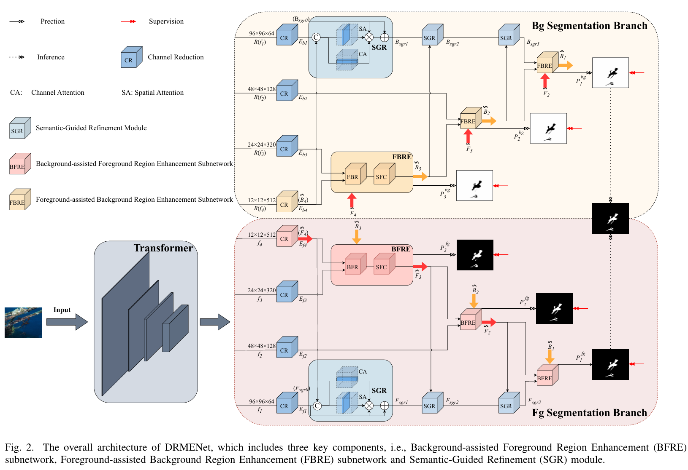
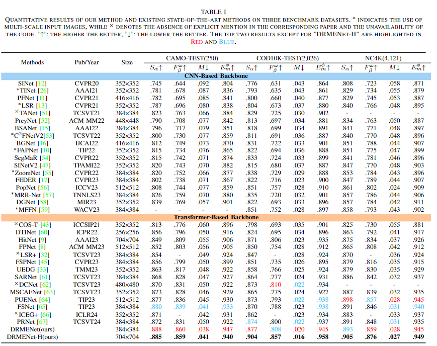

# Dual Region Mutual Enhancement Network for Camouflaged Object Detection




# 1. Abstract

> Camouflaged Object Detection (COD) is a promising yet challenging task that aims to segment objects hidden in intricate surroundings. Current methods often struggle with identifying background regions that resemble camouflaged objects, posing a significant challenge. To mitigate this issue, we propose a novel Dual Region Mutual Enhancement Network (DRMENet), which separately extracts camouflaged object and background region features and these branches mutually assist each other to refine their respective region features. Specifically, in the foreground segmentation branch, we utilize the Background-assisted Foreground Region Enhancement (BFRE) subnetwork to enhance camouflaged object region features with background information. BFRE subnetwork consists of two parts: the Background-subtracted Foreground Refinement (BFR) module and the Scale-wise Feature Capturing (SFC) module, where the former obtains corresponding camouflaged object region features through cross-layer refinement with the assistance of background region features, and the latter captures scale-wise features and outputs a side output for region prediction result. Additionally, considering the noise present in low-level visual features, we introduce the Semantic-Guided Refinement (SGR) module, which progressively refines visual features based on enhanced semantic features. Experiments on challenging datasets show DRMENet's superiority over the existing state-of-the-art methods. 


# 2. Results




# 3. Preparations

## 3.1 Datasets


## 3.2 Create and activate conda environment

```bash
conda create -n DRMENet python=3.8
conda activate DRMENet

git clone https://github.com/ycyinchao/DRMENet.git
cd DRMENet

pip install -r requirement.txt
```


## 3.3 Download Pre-trained weights

The pretrained model is stored in [Google Drive](https://drive.google.com/file/d/1rKmp0Zu1ZL6Z9VsYfYAKRkG271AvZB6G/view?usp=sharing). After downloading, please put it in the './pretrained/' fold.


## 3.4 Train

```bash
python Train.py --train_path 'the path of TrainDataset' --test_path 'the path of TestDataset'
```

Our well-trained model is stored in [Google Drive](https://drive.google.com/file/d/1bDPSdXAaXpGLrxbkB8W9stY8WJefRpU6/view?usp=drive_link), which should be moved into the fold './checkpoints/DRMENet_384/'.


## 3.5 Test

```bash
python MyTesting.py --pth_path 'the path of checkpoint'
```

The more qualitative results of DRMENet on four benchmarks (COD10K, NC4K, CAMO, CHAMELEON) have already been stored in [Google Drive](https://drive.google.com/file/d/1N-JBG244PIzds3pCPCLKTw1V3l1NTQSg/view?usp=drive_link), please unzip it into the fold './results/'.


## 3.6 Eval

```bash
python test_metrics.py
```

the results of evaluation are also in [Google Drive](https://drive.google.com/file/d/1N-JBG244PIzds3pCPCLKTw1V3l1NTQSg/view?usp=drive_link).


# 4. Citation

Please kindly cite our paper if you find it's helpful in your work.

```

```


# 5. License

The source code is free for research and education use only. Any commercial use should get formal permission first.

